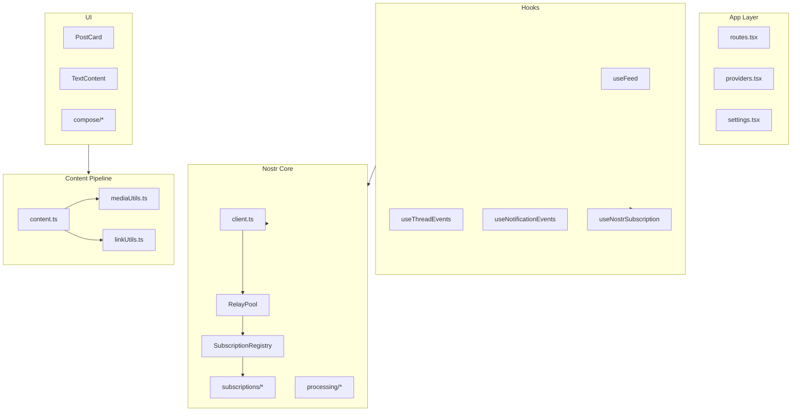

# Code-Simplifier Review: The Wired

**Date:** 2026-06-14  
**Scope:** ~3,829 lines across `src/` (31 UI files, 16 nostr files, 13 utils, 7 hooks)

## Methodology

Review applied the code-simplifier lens across the full codebase:

- Preserve behavior; simplify structure and duplication
- Prefer clarity over brevity (no nested ternaries, no clever one-liners)
- Balance: do not collapse good abstractions

**Verdict:** The architecture is sound for a small Nostr client. Complexity comes from **accumulated duplication** (compose UI, content parsing, event hooks, subscription wrappers), not from over-engineering. No large dead modules; a few unused exports (`closeAll`, `NoteMedia` wrapper).



---

## Critical Finding (Bug, Not Just Style)

[`PostForm.tsx`](../src/features/compose/PostForm.tsx) mutates state without `setUnsigned` (lines 32–54):

```tsx
useEffect(() => {
  if (refEvent && tagType) {
    unsigned.tags.push(["p", refEvent.pubkey]);
    // ...
```

Tags are pushed onto `unsigned` in-place; React never re-renders, and re-running the effect can duplicate tags. Fix in Phase 3 via a `buildUnsignedEvent()` reducer.

---

## Findings by Priority

### P0 — Trivial, zero-risk wins

| # | Finding | Files | Action |
|---|---------|-------|--------|
| 1 | Duplicate PoW total | `feed.ts`, `pow-score.ts` | Use existing `totalWork(event, replies)` |
| 2 | Two subscriptions where one suffices | `notifications.ts` | Single `registry.subscribe([filter1, filter2])` |
| 3 | Whitespace cleanup copied 3× | `linkUtils.ts`, `mediaUtils.ts`, `content.ts` | Extract `normalizeStrippedContent()` |
| 4 | Identical URL regex 2× | `linkUtils.ts`, `content.ts` | Shared `HTTP_URL_PATTERN` |
| 5 | Poll body text duplicated | `TextContent.tsx`, `QuotePreview.tsx` | `getNoteBodyText(event)` helper |
| 6 | PoW transmit status duplicated 2× | `PostForm.tsx`, `PollResponder.tsx` | `PowTransmitStatus` component |
| 7 | `domainFromUrl` duplicated | `LinkPreview.tsx`, `useLinkMetadata.ts` | Single export in `url.ts` |

### P1 — Low effort, high clarity

| # | Finding | Files | Action |
|---|---------|-------|--------|
| 8 | Root-note check duplicated | `global-feed.ts`, `feed.ts` | `isRootNote(event)` in `noteEvents.ts` |
| 9 | Composite `SubHandle` boilerplate 3× | `global-feed.ts`, `thread.ts`, `notifications.ts` | `composeSubHandle(id, children, onClose?)` |
| 10 | Three near-identical event hooks | `useFeed.ts`, `useThreadEvents.ts`, `useNotificationEvents.ts` | `useFilteredNoteSubscription()` factory |
| 11 | Dead `closeAll()` | `subscription-registry.ts` | Remove or wire into provider unmount |
| 12 | `PostCard` overlapping props | `PostCard.tsx` | Collapse `type` + `variant` into one `role` enum |
| 13 | Repeated page layout shell | All feature pages, `ThreadComposer.tsx` | `PageShell` / `ContentColumn` components |
| 14 | `uniqBy` in misnamed file | `otherUtils.ts` | Move to `collections.ts`; optional Map-based impl |

### P2 — Medium effort, structural improvement

| # | Finding | Files | Action |
|---|---------|-------|--------|
| 15 | Subscription DI indirection | `subscriptions/index.ts` + 5 `*Impl` files | Call `getRegistry()` inside each module |
| 16 | `parseContent` triple-parses URLs | `content.ts` | Build attachments from already-parsed `media` + `links` |
| 17 | Thread reply grouping duplicated | `feed.ts`, `ThreadPage.tsx` | Shared `toProcessedEvents(events)` |
| 18 | `processEvents.ts` barrel (3 lines) | `processEvents.ts` | Delete barrel or merge `feed.ts` into it |
| 19 | Thin subscription files | `poll.ts`, `notes-once.ts` | Fold into `index.ts` after #15 |
| 20 | `PostForm` complexity | `PostForm.tsx` | Event-builder reducer; fix mutation bug |
| 21 | `ThreadPage` does too much | `ThreadPage.tsx` | Extract `useThreadViewModel(hexID)` |
| 22 | Layer violation | `PollResponder.tsx` imports `useSubmit` | Move component or hook |
| 23 | `QuotePreview` diverges from `TextContent` | `QuotePreview.tsx` | Use `attachments` pipeline |
| 24 | `ParsedContent.links` unused in prod | `content.ts` | Slim type; derive in tests if needed |

### P3 — Organizational / cross-boundary (defer unless touching build)

| # | Finding | Files | Action |
|---|---------|-------|--------|
| 25 | `normalizeUrl` + `LinkMetadata` duplicated | `mediaUtils.ts`, `api/lib/unfurl.ts` | Shared module + tsconfig path |
| 26 | Arbitrary `src/utils` vs `src/shared/utils` split | Both trees | Consolidate under `src/shared/lib/` |
| 27 | `ThreadPage` manual subscription | `ThreadPage.tsx` | Use `useNostrSubscription` for prev-mentions |
| 28 | `useNostrSubscription` append-only dedup | `useNostrSubscription.ts` | Dedupe at ingest |
| 29 | `cardUtils.ts` only exports `timeAgo` | `cardUtils.ts` | Rename to `timeFormat.ts` |
| 30 | Incomplete barrel | `shared/ui/index.ts` | Expand or document direct-import convention |

---

## What NOT to Simplify

| Abstraction | Why |
|-------------|-----|
| `RelayPool` | Clean relay lifecycle, no React coupling |
| `SubscriptionRegistry` | Centralized sub ID tracking + close handles |
| `global-feed.ts` two-phase subscribe | Domain-specific: roots first, then `#e` replies after delay |
| `thread.ts` dynamic resubscribe | Growing reply trees need refresh |
| `pow-score.ts` + tests | Scoring rules isolated with tests |
| `useNostrSubscription` | Good React boundary for nostr subs |
| `useSubmit` + `usePowMining` | Clean publish vs worker separation |
| `parseContent` orchestration | Single attachment pipeline — extend, don't fork |
| `MetadataRow`, `SegmentedControl` | Small, single-purpose, consistent |

Do **not** merge `RelayPool` and `SubscriptionRegistry`. Do **not** collapse `closeOnEose` usage.

---

## Phased Implementation Roadmap

| Phase | Scope | Est. time | Plan doc |
|-------|-------|-----------|----------|
| 1 | P0 (#1–7) + P1 #8–10 | ~1 hour | [phase-1.md](./simplification/phase-1.md) |
| 2 | P1 #11–14 + P2 #15–19 | ~2–3 hours | [phase-2.md](./simplification/phase-2.md) |
| 3 | P2 #20–24 | ~3–4 hours | [phase-3.md](./simplification/phase-3.md) |
| 4 | P3 #25–30 (optional) | TBD | [phase-4.md](./simplification/phase-4.md) |

Each phase gets its own plan document before implementation begins.

---

## Test Safety Net

Run `bun run test && bun run typecheck` after each phase.

Highest-risk refactor zones (well-tested):

- `content.test.ts`, `linkUtils.test.ts`, `mediaUtils.test.ts`
- `pow-score.test.ts`, `processEvents.test.ts`

Content-pipeline refactors (P2 #16, #24) need the most test attention.

---

## Summary

| Metric | Value |
|--------|-------|
| Total simplification opportunities | ~30 |
| Quick wins (P0) | 7 |
| Structural (P2) | 10 |
| Safe to defer (P3) | 6 |
| Bug found | 1 (`PostForm` state mutation) |
| Dead code | `closeAll()`, `NoteMedia` export |

The codebase is **maintainable as-is** but would benefit most from: (1) shared text/URL helpers, (2) a note-subscription hook factory, (3) compose UI dedup + `PostForm` fix, and (4) nostr subscription wrapper collapse.
