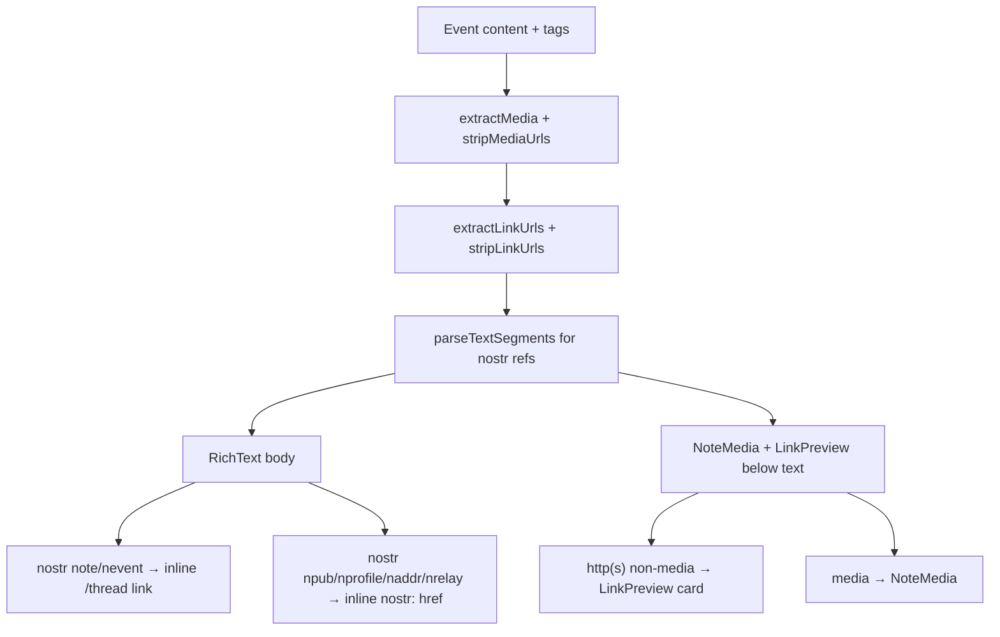

# Wired Frontend Design

**Project:** Wired (getwired.app)  
**Concept:** Signal in the Void  
**Stack:** React 18, TypeScript, Vite 6, Tailwind 3.4, Bun  
**Deploy:** Vercel  
**Scope:** Presentation layer — features consume primitives from `src/shared/ui/`; Nostr/hooks/workers unchanged

---

## 1. Vision and Principles

Wired is an anonymous Nostr social feed where proof-of-work filters noise. The interface should feel like tuning into a faint transmission: sparse, legible, slightly uncanny. Not a terminal cosplay, not a cyberpunk theme park — a quiet room where text arrives from elsewhere and resolves into meaning.

**Aesthetic:** brutal minimalism with one cryptic accent (`--signal` teal).

| Principle | Meaning | Constraint |
|-----------|---------|------------|
| **Stillness over spectacle** | Motion is rare and purposeful | One `resolve-in` on initial feed batch; no looping ambient effects |
| **Signal, not decoration** | Every element earns its place | Single accent; metadata whispers on hover, AA-readable on touch |
| **Hierarchy through weight** | Read posts first, telemetry second | Three type scales; metadata lowest contrast on `(hover: hover)` |
| **Links resolve from text** | Nostr identifiers linkify inline in the body | `note`/`nevent` → in-app thread; other bech32 → `nostr:` href |
| **Previews resolve below** | External URLs become preview cards | Non-media `http(s)` stripped from body; `LinkPreview` below text |
| **Media resolves below** | Attachments render under the body | `NoteMedia` for `imeta` + bare media URLs; stripped from text |
| **Depth without chrome** | Thread structure via space and fade | Indent + opacity; no card borders on feed |
| **Architecture untouched** | Visual layer only | Flat `src/shared/ui/`; no hook/Nostr changes |

### Success criteria

- Initial feed batch resolves (~600ms stagger), then static; infinite-scroll appends do not re-resolve
- WCAG 2.1 AA for body, nav, buttons, and informative metadata
- `prefers-reduced-motion: reduce` disables resolve animation
- PoW displayed as `signal N`; header uses path-as-signal (no `~/WIRED>` cosplay)
- Navigable posts: `role="group"` + dedicated `open` control in `MetadataRow`
- All pages inherit `bg-void`; no local `bg-black`

---

## 2. Content Rendering

Post body rendering is a three-pass pipeline. Poll prompts and quote compose text follow the same rules.



### Pipeline

1. **Media** — `imeta` tags + bare media-extension URLs → `NoteMedia`; URLs removed from visible text ([`src/utils/mediaUtils.ts`](../src/utils/mediaUtils.ts)).
2. **Link URLs** — non-media `http(s)://` URLs → `LinkPreview` cards; URLs removed from visible text (same strip pattern as media).
3. **Nostr refs** — remaining text parsed into plain + link segments; nostr tokens stay inline in the body.
4. **Render** — `TextContent` outputs `RichText` body, then attachment stack below (outside collapse).

### Token rules

| Token in source | In body text | Below text |
|-----------------|--------------|------------|
| Media URL / `imeta` | Stripped | `NoteMedia` |
| `https?://…` (non-media) | Stripped | `LinkPreview` |
| `nostr:note1…` / `nostr:nevent1…` | Inline `<Link to="/thread/{bech32}">` | — |
| `nostr:npub1…` / `nprofile1…` / `naddr1…` / `nrelay1…` | Inline `<a href="nostr:…">` | — |

Attachment order follows source order: media and link previews interleaved as they appear in the original content.

### `parseContent` contract

```ts
// src/utils/content.ts (target shape)
type ParsedContent = {
  comment: string;       // text after media + link URL stripping
  media: MediaItem[];
  links: LinkItem[];     // { url: string }[], deduped, source order
};
```

Nostr refs are **not** stripped — `linkify.ts` handles them at render time.

### `RichText`

Renders `comment` as alternating plain-text and nostr-link segments.

- Plain runs: `whitespace-pre-wrap`, `text-body text-primary`
- Nostr links: `text-signal underline-offset-2 hover:text-primary`, `focus-visible` ring per §9
- Full bech32 displayed (no truncation)
- Segment-based renderer only — no `dangerouslySetInnerHTML`
- Collapse at 750 plain-text chars (`continue` / `collapse`); attachments always visible

### `NoteMedia` / `AttachmentStack`

`AttachmentStack` renders the attachment list below text (used by `TextContent` and `QuotePreview`). Consecutive image runs use `MediaGrid`; links, video, and audio stay full-width and interleaved in source order.

| Image count (consecutive run) | Layout |
|-------------------------------|--------|
| 1 | Full-width `MediaAttachment`, `object-contain`, `max-h-[32rem]` |
| 2 | `grid-cols-2` mosaic, `object-cover`, square cells |
| 3 | Tall left + two stacked right (`row-span-2`) |
| 4 | `grid-cols-2` × 2 rows |
| 5+ | Same 2×2 grid; fourth cell shows `+N` overlay for hidden extras |

- Grid cells: lazy, `border border-ghost`, per-cell `signal lost` on error
- Video/audio: native controls, never grouped into grids
- Orphan `imeta` URLs (not in body text) append after content-order URLs

### `LinkPreview`

Block card aligned with `NoteMedia` — ghost border, no card chrome.

```
┌─ LinkPreview ─────────────────────────────┐
│  [optional og:image — max-h-48, cover]      │
│  title (text-primary, line-clamp-2)       │
│  description (text-secondary, line-clamp-1) │
│  domain.com (text-meta text-muted)        │
└─────────────────────────────────────────────┘
  entire card: <a target="_blank" rel="noopener noreferrer">
```

| State | UI |
|-------|-----|
| Loading | `text-meta text-muted` — `resolving link…` (no skeleton pulse) |
| Ready | OG title, description, optional image |
| Failed | `signal lost` + domain label |
| No image | Text-only layout |

Stack: `flex flex-col gap-3` via `AttachmentStack`. Multiple link URLs → multiple cards; multiple images → mosaic grid when consecutive.

**Metadata fetch:** UI and component contract defined here; fetch mechanism (likely server-side unfurl on Vercel) deferred to implementation.

### Security

- External hrefs: `http:` / `https:` only — reuse `normalizeUrl` from `mediaUtils.ts`
- Nostr hrefs: match `NOSTR_REF_PATTERN` in `content.ts`
- Reject `javascript:`, `data:`, and other non-http(s) schemes
- Preview fetch: metadata extraction only; no execution of target-page JS

### PostCard interaction

Posts use `role="group"` with a dedicated `open` button in `MetadataRow` — not `role="link"` on the article (nested interactives: expand, poll vote, inline nostr links, preview cards).

- Inline nostr links and preview `<a>` elements do not trigger thread navigation
- Preview cards are separate tab-stops from the `open` button
- Poll option buttons are form controls, not body hyperlinks

### Compose behavior (unchanged)

Quote compose still appends `nostr:note…` to textarea content. Poll creation (kind 1068) tag structure unchanged.

---

## 3. Design Tokens

Defined in [`src/styles/index.css`](../src/styles/index.css) and [`tailwind.config.js`](../tailwind.config.js).

### Surfaces and text

| Token | Value | Usage |
|-------|-------|-------|
| `--void` | `#050508` | Page background |
| `--surface` | `#0a0a0f` | Compose, inputs |
| `--surface-raised` | `#111118` | Raised controls |
| `--text-primary` | `#e8e8ec` | Post body (15.2:1 on void) |
| `--text-secondary` | `#8a8a96` | Nav, labels, touch metadata (5.8:1) |
| `--text-muted` | `#4a4a56` | Decorative metadata on `(hover: hover)` |
| `--signal` | `#5eead4` | PoW, focus, active nav (9.1:1) |
| `--danger` | `#f87171` | Form errors (5.4:1) |

### Typography

**IBM Plex Mono** — self-hosted woff2 in `public/fonts/` (weights 400, 500), `font-display: swap`.

| Scale | Size | Usage |
|-------|------|-------|
| `text-display` | 18px | Rare emphasis |
| `text-body` | 15px | Post body, controls |
| `text-meta` | 12px | Metadata, labels |
| `text-micro` | 11px | Rare compact copy |

### Layout

- `--content-max: 36rem` → `max-w-content`
- `--header-height: 3rem`
- Grain overlay at `--grain-opacity: 0.025` via `NoiseOverlay`

---

## 4. Visual Language

### Lain → UI mapping

| Motif | Expression |
|-------|------------|
| Ambient network | Dark void, faint grain, no chrome |
| Signal acquisition | One-time `resolve-in` on first feed batch |
| Layered depth | Thread indent + opacity fade |
| Whispered identity | `SignalAvatar` pubkey glyph |
| Invisible infrastructure | `signal 847` telemetry copy |
| Sparse rooms | Wide margins, narrow column |

### Anti-patterns (do not ship)

| Avoid | Use instead |
|-------|-------------|
| Terminal cosplay header | `signal /{segment}` path-as-signal |
| CRT / scanlines | Grain only at 2–3% |
| Rainbow gradient avatars | `SignalAvatar` FNV-1a SVG |
| Ambient `animate-pulse` | Per-post resolve on initial batch only |
| Inconsistent blues (`sky-800`, etc.) | `--signal` everywhere |
| Skeleton loaders | `acquiring signal…` text only |
| Hand-rolled toggles | `SegmentedControl` |
| Card boxes | Borderless post surfaces |
| Hashrate in mining UI | `computing signal… ~12s` |

**Mood:** `void`, `resolve`, `whisper`, `telemetry`, `indent`, `stillness`, `anonymous`, `received`

### Metadata contrast

| Context | Default | On interaction |
|---------|---------|----------------|
| `(hover: hover)` | `--text-muted` | `--text-secondary` on post `:hover` / `:focus-within` |
| `(hover: none)` | `--text-secondary` always | Same |
| Keyboard focus | `--text-secondary` via `:focus-within` | — |

Navigable posts expose summary via `article aria-label` regardless of visual contrast tier.

---

## 5. Motion

| Interaction | Animation | Duration | Reduced motion |
|-------------|-----------|----------|----------------|
| Initial feed batch (posts 3–19) | `resolve-in` + 40ms stagger | 600ms | Disabled — instant opacity 1, no blur/transform |
| First 3 feed posts | none (LCP) | 0 | Same |
| Infinite-scroll append | `fade-in` or none | 200ms / 0 | Instant |
| Metadata row | color transition | 150ms | Same |
| Focus ring | box-shadow | 100ms | Same |
| PoW mining | text swap | — | No pulse |
| Placeholder | none | — | Static copy |
| Link preview load | text swap | — | No pulse |

Resolve window closes ~1360ms after mount (`600ms + 20×40ms`). Appended posts never re-resolve. Do not tie resolve to scroll events.

```css
@media (prefers-reduced-motion: reduce) {
  .animate-resolve-in, .animate-fade-in {
    animation: none !important;
    opacity: 1 !important;
    filter: none !important;
    transform: none !important;
  }
}
```

---

## 6. Layout and Pages

### Global shell

```
┌─────────────────────────────────────────────────────────────┐
│  signal /route                         activity    settings   │  h-12
│  [skip to content — sr-only, focus visible]                   │
├─────────────────────────────────────────────────────────────┤
│                    ┌─────────────────┐                      │
│                    │  max-w-content  │                      │
│                    └─────────────────┘                      │
└─────────────────────────────────────────────────────────────┘
```

- `body`: `bg-void text-primary font-mono text-body antialiased`
- `NoiseOverlay` in `App.tsx`
- Skip link → `#main-content` on every route
- Route labels via [`routeLabelMap.ts`](../src/shared/ui/routeLabelMap.ts): `/notifications` → `activity`

### Feed

- Compose row and post list both `max-w-content mx-auto`
- `FeedSortToggle` → `SegmentedControl` (`signal` / `time`), vertical at `sm+`, horizontal below
- No feed-wide pulse animation

### Thread

- Context posts: `variant="context"`, opacity 0.7
- OP: `variant="op"`, no navigation
- Depth via `getThreadDepth()`: `pl-4/8/12` + opacity 0.92/0.84/0.76
- Low-signal filter: copy only (`reveal low-signal` / `hide low-signal`); threshold unchanged
- Error: `invalid signal ref` + `return` button

### Compose

- `Textarea variant="compose"`, submit `transmit`
- Mining: `computing signal… ~12s` — no hashrate, no pulse

### Settings / Notifications

- Settings: vertical stack, `max-w-content`, all primitives
- Notifications desktop: two columns; mobile: `SegmentedControl` — `yours` | `mentions`

### Polls

- Create: `Button`, `Input` for options and minimum vote signal
- Responder: option vote `Button variant="ghost"`, signal stepper, `results`, `transmit`
- Poll prompt in `TextContent` follows content rendering rules; vote controls are siblings in `PollResponder`

---

## 7. Components

Flat directory: [`src/shared/ui/`](../src/shared/ui/).

### Primitives

| Component | Notes |
|-----------|-------|
| `Button` | `primary` / `ghost` / `danger`; `sm` / `md`; `min-h-[24px] min-w-[24px]` |
| `Input` | `aria-invalid`, `role="alert"` errors |
| `Textarea` | `default` / `compose` variants |
| `SegmentedControl` | APG radiogroup; arrow keys required |
| `SignalAvatar` | FNV-1a → 4×4 SVG, `fill="var(--signal-dim)"` |
| `MetadataRow` | `{avatar} {pubkey8} · signal {n} · {count} replies · {time}` |
| `NoiseOverlay` | Fixed grain, `aria-hidden` |

### Compositions

| Component | Notes |
|-----------|-------|
| `PostCard` | `role="group"`; `open` button for navigation; depth/variant/animate props |
| `TextContent` | `RichText` + `NoteMedia` + `LinkPreview` + collapse + `PollResponder` |
| `RichText` | **New** — nostr inline links from `linkify.ts` |
| `NoteMedia` | Media attachments below text |
| `LinkPreview` | **New** — OG preview cards below text |
| `ReplyContext` | `re {pubkey8} +{n}` |
| `QuotePreview` | Compose quote snippet (280 chars) |
| `Placeholder` | `acquiring signal…` — no skeleton |
| `FeedSortToggle` | Responsive `SegmentedControl` orientation |
| `Header` | Path-as-signal + skip link + nav |

### Planned utilities

| File | Role |
|------|------|
| `src/utils/linkUtils.ts` | `extractLinkUrls`, `stripLinkUrls` |
| `src/utils/linkify.ts` | `parseTextSegments(content): TextSegment[]` |

---

## 8. Copy and Voice

- Terse, lowercase UI labels
- PoW → **signal** everywhere user-facing
- No hashrate in mining UI

| Old | New |
|-----|-----|
| PoW 847 | signal 847 |
| Submit | transmit |
| Doing Work / 42kH/s | computing signal… ~12s |
| Your Recent Posts | your transmissions |
| Show All Replies | reveal low-signal |
| Hide 0 PoW Replies | hide low-signal |
| Show Results | results |
| Invalid note ID | invalid signal ref |
| Back to feed | return |

Mobile: `your transmissions` → `yours` in `SegmentedControl`.

Metadata format: `{pubkey8} · signal {n} · {count} replies · {time}` — omit signal when zero; reposts append `· signal +{n}`.

---

## 9. Accessibility

| Element | Requirement | Implementation |
|---------|-------------|----------------|
| Body text | ≥ 4.5:1 | `--text-primary` on `--void` |
| Nav links | ≥ 4.5:1 | `--text-secondary`; active `--signal` + `aria-current` |
| Touch metadata | ≥ 4.5:1 | `--text-secondary` on `(hover: none)` |
| Focus indicators | ≥ 3:1 | `--signal-dim` ring |
| Targets | ≥ 24×24px | Button, SegmentedControl segments |
| Form errors | Programmatic | `aria-invalid`, `aria-describedby`, `role="alert"` |
| PostCard | Keyboard operable | `open` button; `role="group"` |
| Skip link | Bypass block | First focusable in header |
| Motion | Reduced motion | Explicit filter/transform nullify |
| Link previews | Descriptive | Card `aria-label` with title + domain; external link context |

### Focus-visible

```css
:focus-visible {
  outline: none;
  box-shadow: 0 0 0 2px var(--void), 0 0 0 4px var(--signal-dim);
}
```

### Tab order

1. Skip link → header nav → main → compose → feed posts
2. Per post: content links/previews → expand → poll controls → `open` button
3. `SegmentedControl`: arrow keys per APG

---

## 10. Key Decisions

| Decision | Choice | Rationale |
|----------|--------|-----------|
| Design concept | Signal in the Void | Unifies grain, resolve, telemetry copy |
| Accent | `--signal: #5eead4` (teal) | AA on void; distinct from danger |
| Font | IBM Plex Mono, self-hosted woff2 | One delivery path; readable at 15px |
| Header | Path-as-signal | `signal /{segment}`; no terminal cosplay |
| Components | Flat `src/shared/ui/` | Simple imports |
| Post surfaces | Borderless | Brutal minimal |
| Avatar | FNV-1a SVG `SignalAvatar` | Sync, crisp at 20px |
| Motion | Resolve initial 20 only | Stillness after acquisition |
| Metadata | Responsive disclosure | Whisper on desktop; AA on touch |
| PostCard nav | `role="group"` + `open` button | Nested interactives safe |
| Nostr inline links | `note`/`nevent` in-app; others `nostr:` href | Thread navigation without new routes |
| External URLs | `LinkPreview` cards, stripped from body | Clean text + rich attachment |
| Media | `NoteMedia` below text, stripped from body | Nostr `imeta` interoperability |
| Mining copy | No hashrate | Avoids terminal cosplay |
| Backgrounds | `bg-void` inherited | No local `bg-black` |
| Deploy | Vercel | SPA rewrites in `vercel.json` |

---

*Last updated: 2026-06-14*